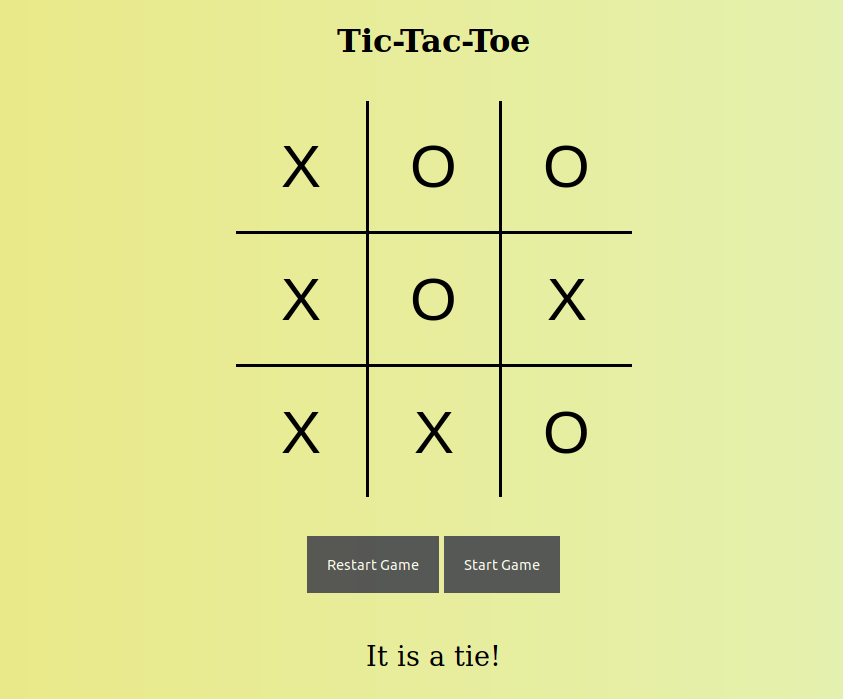

# Tic-Tac-Toe

Demo: https://kennethnguyen.github.io/tic-tac-toe

## Screenshot (As of October 8, 2019)

## Description

A rendition of the classic game "Tic Tac Toe" with a simple user interface. To play the game, click on 'Start Game' button and type in the first and second player's marker. After a game is finished, press 'Restart Game' and 'Start Game' again to play another round.

Inspired by [The Odin Project's Javascript Course](https://www.theodinproject.com/courses/javascript/lessons/tic-tac-toe-javascript)

## Utilized

* HTML | Javascript | CSS

## Todo

* Create an AI Bot for users to play against
* Multiple matches (keeping a record of previous matches)
* Disable start game button while a match is happening or finished
* Create a form for users to input desired marker(s), number of players & option to vs. a Bot or Player, and number of concurrent rounds 
* CSS 

## Author

Kenneth Nguyen